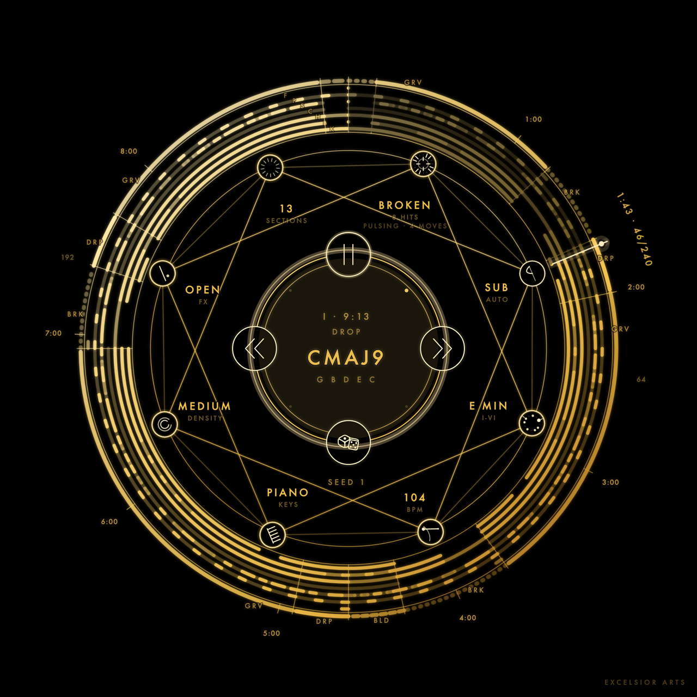
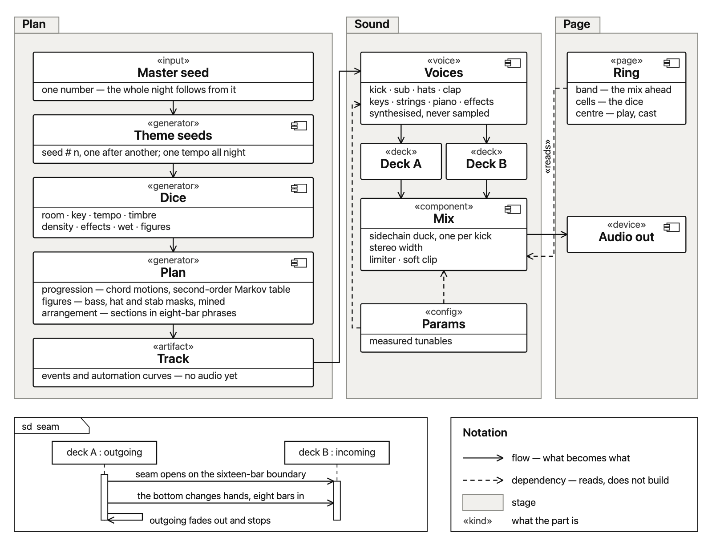

<h1 align="center">D E E P &nbsp; H O U S E</h1>

<b>An endless deep house set, generated in your browser. Nothing is recorded: every sound is built as it plays.</b>

Touch the centre to start. The outer band is the mix ahead — drag it to move
through it, flick it to skip — the eight cells of the star are the dice this
theme was rolled from, and the dice under the centre cast a new set.

One number is the whole night. Each theme takes its own seed from it and rolls
its own dice — the room, the key, the tempo, the timbre, how dense it is, how
wet, and which figures it plays. Those become a plan: chord motions walked out
of a mined table, bass, hat and stab figures drawn from the same tables, and an
order of sections in eight-bar phrases. The voices that play it — kick, sub,
hats, clap, keys, strings, piano, effects — are every one of them synthesized
from oscillators and noise, and two decks run them together the way a set runs:
one tempo all night, a seam on a phrase boundary, the bottom changing hands
eight bars into the blend. How the sound is levelled is drawn in
[the mastering chain](docs/mastering.png).

## License

[PolyForm Noncommercial 1.0.0](LICENSE) — yours to listen to, play with and
learn from; selling it or running it for other people is a conversation. Nothing
else is in it: [THIRD-PARTY.md](THIRD-PARTY.md).

<a href="https://github.com/excelsior-arts">Excelsior Arts</a>

