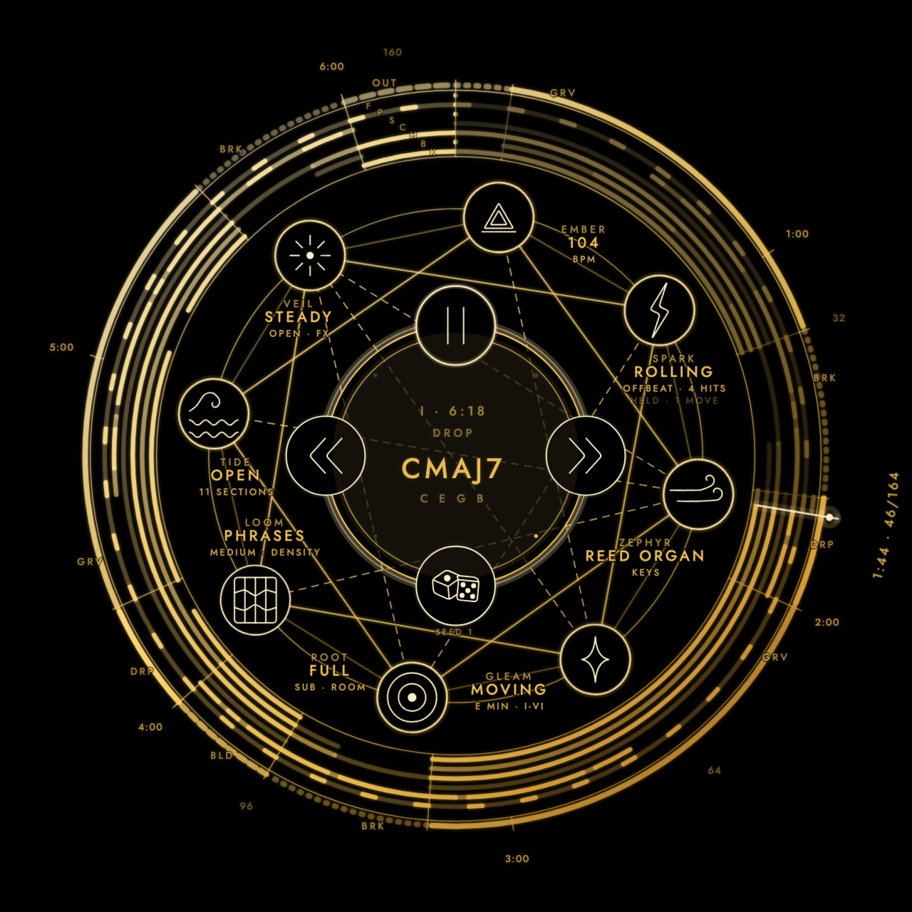
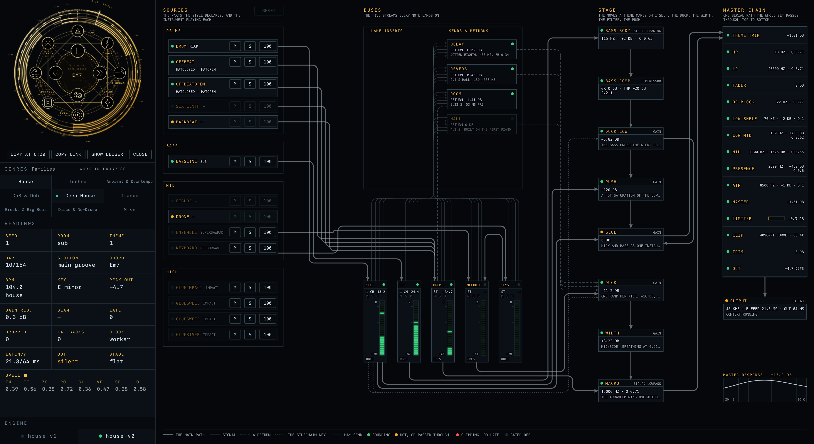

<h1 align="center">D E E P &nbsp; H O U S E</h1>

<b>Offline Electronic Music Generator</b>  A music companion. No distracting vocals. No agenda. Just vibes.

The default sound is tuned to deep house; other genres are being built and
coming soon. Right now the player is at its best on its default lightweight deep
house themes and on slow-beat ambient soundscapes (turn Ember down). The link is
always the track that plays: share it, and it plays the same anywhere.

The interface was built with alchemy in mind. We try our luck by rolling the
dice, and we cast spells by rearranging the sigils. We rarely know how it will
turn out, so the app is more often a journey than a destination.

<i>A live screenshot of the machine. Tap the gear button to watch it work in real time, like a DAW: every voice, bus and meter of the track that is playing.</i>

One number runs the whole set. Each theme takes its own seed from it and rolls
the room, the key, the tempo, the density and the figures. That becomes a plan
in eight-bar phrases: chords, bass, hats, stabs.

Every voice is synthesized — kick, sub, hats, clap, keys, strings, piano, fx.
Two decks share one tempo, mix on a phrase, and hand the bass over eight bars
into the blend.

## License

[PolyForm Noncommercial 1.0.0](LICENSE) — yours to listen to, play with, learn
from and run for others; the tracks it makes are not for commercial use. Nothing
else is in it: [THIRD-PARTY.md](THIRD-PARTY.md).

<a href="https://github.com/excelsior-arts">Excelsior Arts</a>

